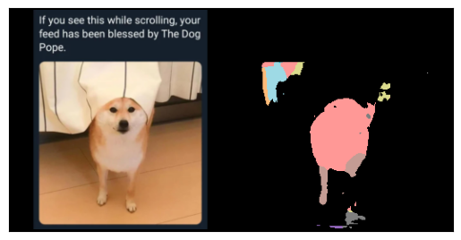

# dogunet

Dog-UNet? Dogu-NET? You decide. The important part is that we are here to find beautiful dogs.

This is a simple U-Net experiment that I wrote while learning PyTorch and UNets.

Please do not use in production.
